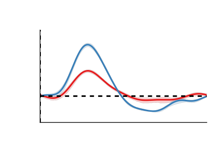

.. nideconv documentation master file, created by
   sphinx-quickstart on Sat Nov 11 16:45:31 2017.
   You can adapt this file completely to your liking, but it should at least
   contain the root `toctree` directive.

Welcome to nideconv
===========================================

Nideconv is an easy-to use Python library that can perform automated 
deconvolution of (primarily) slowly fluctuating (proxies of) neural signals like 
pupil size and BOLD fMRI. It was developed at the Vrije Universiteit 
and the Spinoza Centre for Neuroimaging by Gilles de Hollander and Tomas Knapen.

.. toctree::
   :maxdepth: 1
   :caption: Getting started

   installation

.. toctree::
   :maxdepth: 1
   :caption: Tutorials

   tutorials/plot_what_is_deconvolution
   tutorials/plot_basis_functions
   tutorials/plot_group_analysis
   tutorials/plot_bayesian_analysis

.. toctree::
   :maxdepth: 2
   :caption: Examples

   auto_examples/extract_timeseries_fmriprep

.. toctree::
   :maxdepth: 2
   :caption: Reference

   response_fitter/ResponseFitter
   group_analysis/GroupResponseFitter
   nifti/NiftiResponseFitter
   simulate/simulate_fmri_data
   roi/get_fmriprep_timeseries

